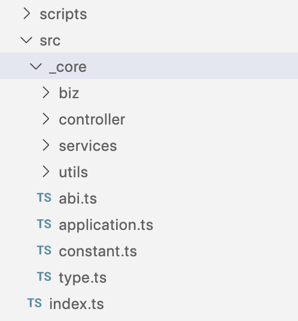

# How To Develop

## Organization

The source code is organized like below:



When adding your logic to the project, please remember one rule: **NEVER CHANGE THE CODE IN `_core`**, the code in it will be encapsulated in the framework in future versions.

## Features

1. DI Container
   - @fastify/awilix
1. Supporting Services
   - db + jwt (static jwt for now)
1. Router Builder
   - controller + action + jwt hook
1. Application Class
1. Request Schema
1. Typesafe Env
1. Swagger UI
1. DBM

## DBM Flow

1. add/change tables in `src/schema.ts`.
1. `npm run generate`.
1. review generated sql files.
1. `npm run migrate`
1. continue the loop of 1~4 until you have done.

> WARNING
> Don't change the `drizzle` manually, if you want to drop any migrations, try `npm run drop`.

Note: for db orm tools, we intentionally exclude `prisma`, reasons:

- `prisma` is heavy weight.
- `drizzle` can work with `postgres.js` which is the fastest pg driver in node.
- `drizzle` is more sql aware, without sql in head, orm tools can be abused.

## Feature Examples

1. Application

```ts
new Application()
  .pgOpts(...)
  .controllers(controllers)
  .securityRules(securityRules)
  .start(port, host);
```

Note:

- if the predefined options not set, the predefined service will not be initialized. ie: no pgOpts, no dbService.
- you can always register your own service: `Application.register`
- the predefined services have predefined names.

2. Controller + Action + JWT Rules

```ts
function handler1(request: FastifyRequest, reply: FastifyReply) {
  reply.code(200).send('handler1');
}

async function handler2(request: FastifyRequest, reply: FastifyReply) {
  reply.code(201).send('handler2');
}

const controllers: Controller[] = [
  {
    prefix: '/',
    actions: [{path: '/test', method: 'get', handler: handler1}],
  },
  {
    prefix: '/sub',
    actions: [{path: '/test', method: 'post', handler: handler2}],
  },
  {
    prefix: '/protected',
    actions: [{path: '/test', method: 'get', handler: handler1}],
  },
  {
    prefix: '/protected',
    actions: [{path: '/test', method: 'post', handler: handler2}],
  },
  {
    prefix: '/banned-all',
    actions: [{path: '/test', method: 'all', handler: handler1}],
  },
];

const securityRules: JwtFilterRule[] = [
  {pattern: /^\/protected/, httpMethod: 'post'},
  {pattern: /^\/banned-all/},
];
```

3. Get the injected service

```ts
// in an action
async function actionHandler(
  this: FastifyInstance, // NOTE: it MUST be named 'this'
  request: FastifyRequest,
  reply: FastifyReply
) {
  const injected = this.diContainer.resolve(name);
  ...
}

// in a service, you can get it in constructor.
// the parameter is Awilix Cradle
constructor(opt: any) {
  const injected = opt[name];
}

// out of a service, you can get it by application.resolve
const app = new Application().register({test: asValue('test')});
t.is(app.resolve('test'), 'test');
```

4. Request Schema

```ts
export const listUser: Action = {
  path: '/',
  method: 'get',
  options: {
    schema: {
      response: {
        200: z.array(selectSchema),
      },
    },
  },
  handler: listUserHandler,
};
```

5. Typesafe Env

```ts
export const env = createEnv({
  clientPrefix: '',
  server: {
    JWT_SECRET: z.string().default('SuPeRpaSsW0rd'),
    FASTIFY_PORT: z.coerce.number().default(3006),
    FASTIFY_ADDRESS: z.string().default('127.0.0.1'),
    LOG_LEVEL: z.string().default('debug'),
    DB_HOST: z.string().default('127.0.0.1'),
    DB_PORT: z.coerce.number().default(5432),
    DB_USER: z.string().default('test_admin'),
    DB_PASSWORD: z.string().default('admin'),
    DB_DATABASE: z.string().default('test'),
  },
  client: {},
  runtimeEnv: process.env,
});
```

6. Swagger UI

- `npm start`
- goto: http://127.0.0.1:3006/documentation
